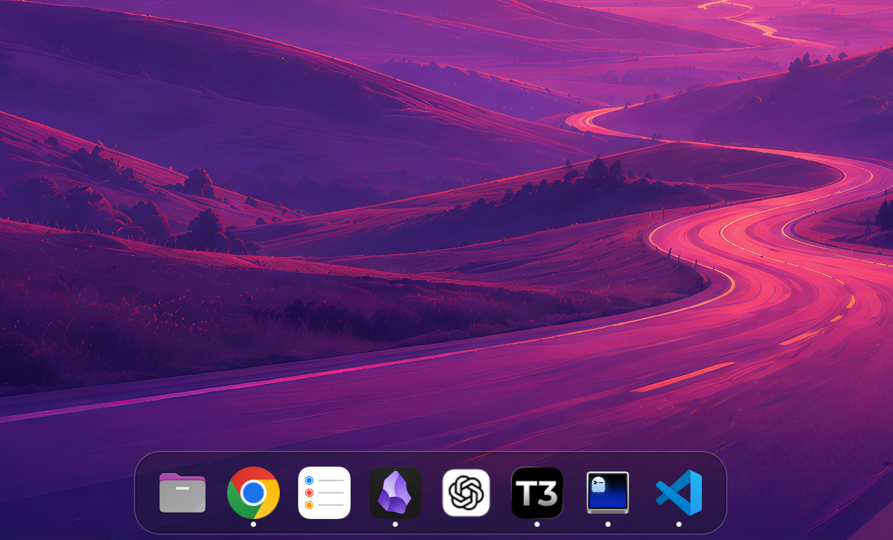

# SmartDock for Omarchy

> Local Omarchy variant: pinned applications remain first, while eligible
> running applications are appended automatically according to the configured
> window scope.

A theme-aware application, window, and workspace dock for Omarchy and Hyprland, built with Quickshell and Qt/QML.


## Features

- Smooth pointer-distance magnification
- Freedesktop application icons and launching
- Configurable application-icon left, middle, Shift+left, and scroll actions
- Grouped-window wheel cycling with high-resolution vertical-delta accumulation
- Per-workspace and per-monitor running-window scopes with optional true-Hyprland urgent exceptions
- Focuses an existing application on another workspace
- Running-application indicators
- First-position sliders control for the app launcher, Dock Settings, adding
  applications, and auto-hide
- Bundled Lucide SVG artwork for the Trash icon and dock context-menu actions
- Theme-aware graphical settings panel with live previews and persistent changes
- Dynamic Trash icon with item count, open, and confirmed empty actions
- Compact trailing workspace switcher that mirrors the Omarchy top-bar visibility rule
- Minimized-window markers, counts, tooltip summaries, and per-window status labels
- Fullscreen focus emphasis that enlarges the owner and fades other dock icons
- Per-window right-click management for workspace moves, fullscreen-with-bars,
  Hyprland-style minimize/restore, floating, workspace pinning, focus, and close
- Drag-to-reorder with persistent pinned-app order
- Context-menu hiding with persistent restoration controls in Dock Settings
- Right-click actions to launch, close, pin, or unpin applications
- Fuzzy application search for adding dock items
- Configurable dock background transparency
- Omarchy theme-aware surfaces, borders, corner radius, typography, and hover states
- Optional reserved screen space while the dock is visible
- Optional auto-hide with screen-edge reveal
- Live JSON configuration reload
- Multi-monitor support

## Requirements

- Hyprland
- Quickshell 0.3 or newer
- GLib's `gio` command for Trash integration
- A working freedesktop icon theme



## Install

Install the Git-managed Omarchy plugin from the SmartDock fork:

```bash
omarchy plugin add https://github.com/fernandodamaso/smart-omarchy-dock.git --enable --yes
```

The normal update command is:

```bash
omarchy plugin update io.github.fernandodamaso.smartdock --yes
```

Updates pull the fork's default `main` branch and preserve
`~/.config/smartdock/dock.json`. Installed plugin files are deployment state;
do not edit them directly. Development belongs in a separate clone, such as
`/home/admin/Projects/smart-omarchy-dock`, and changes reach an installed copy
through Git push followed by `omarchy plugin update`.

### Standalone installation

Standalone use is a secondary mode. From a source checkout, make sure
Quickshell is installed and run:

```bash
./install.sh
```

The installer uses only user directories, requires no `sudo`, and creates an
XDG autostart entry. To install without autostart, use
`./install.sh --no-autostart`.

Run the standalone dock immediately with:

```bash
smartdock --daemonize
```

Installed copies appear as **SmartDock for Omarchy** in application launchers.
Run `smartdock help` to see every command.

Manage autostart later from the CLI:

```bash
smartdock autostart status
smartdock autostart enable
smartdock autostart disable
```

### Update or remove

`smartdock update` only refreshes an installed standalone copy from its local
source copy. It does not update the Omarchy plugin; use the Git-managed
`omarchy plugin update` command above for that.

```bash
smartdock update
smartdock restart
smartdock uninstall
```

Uninstalling preserves the configuration; remove it too with
`smartdock uninstall --purge`.

## Run as an Omarchy plugin

Omarchy users should run SmartDock inside the existing Omarchy shell rather
than starting a second Quickshell process. The installed plugin ID is
`io.github.fernandodamaso.smartdock`:

```bash
omarchy plugin enable io.github.fernandodamaso.smartdock
```

The plugin uses `~/.config/smartdock/dock.json`, shared with the standalone
version. Do not run the standalone and plugin versions together, or two docks
will appear.

### Development

Development happens in the canonical source checkout or in your own clone,
never in the installed Omarchy checkout:

```bash
cd /home/admin/Projects/smart-omarchy-dock
./scripts/run
```

Quickshell watches the QML files, so UI changes reload while developing.

## Project history

SmartDock for Omarchy is an extensively developed MIT-licensed fork of
[nick-friedrich/hyprland-dock](https://github.com/nick-friedrich/hyprland-dock).
The upstream Git history, MIT license, and original copyright notice are
preserved in this repository.

## Configure

Installed copies use `~/.config/smartdock/dock.json`. When running from the repository, edit [`config/dock.json`](config/dock.json):

The same settings are available graphically: click or right-click the first
sliders icon and choose **Dock Settings…**. Slider changes preview while dragging and
are saved when released; switches and choices save immediately.

Dock Settings uses an icon-led responsive card layout. Icon geometry and hover
effects sit side by side, Dock surface exposes Theme default, Omarchy token,
and custom hex modes without leaving disabled inputs visible, and Layout and
Behavior share a compact row. Behavior includes the window-scope selector, its
urgent-exception toggle, and four application action selectors for Left click,
Middle click, Shift+left, and Scroll. Advanced launcher settings expand on
demand; Reset and Close remain fixed at the bottom. On narrow screens the card
grid stacks and the middle content area scrolls while the header and footer
remain visible. The centered panel leaves the dock's edge strip interactive, so
moving over dock icons continues to preview magnification and hover glow while
you adjust settings.

Background and border overrides use a progressive control: choose **Theme
default**, pick an Omarchy token (for example `@accent`, `@menu.background`, or
`@popups.border`), or enable **Custom hex** and use the clickable alpha-aware
color swatch or manual `#RRGGBB` / `#AARRGGBB` entry. Token selections store the
symbolic reference so the color follows future theme changes; custom hex values
store a fixed override. The border width similarly switches between the theme
width and a **Custom width** slider, preserving the stored width when the
override is disabled.

```json
{
  "iconSize": 42,
  "magnification": 1.2,
  "magnificationRadius": 95,
  "hoverGlowEnabled": true,
  "hoverGlowOpacity": 0.72,
  "hoverGlowRadius": 28,
  "margin": 10,
  "backgroundOpacity": 0.88,
  "backgroundColorEnabled": false,
  "backgroundColor": "",
  "borderColorEnabled": false,
  "borderColor": "",
  "borderWidthEnabled": false,
  "borderWidth": 2,
  "position": "bottom",
  "fullLength": false,
  "reserveSpace": true,
  "autoHide": false,
  "clickAction": "focus-or-launch",
  "middleClickAction": "none",
  "shiftClickAction": "none",
  "scrollAction": "none",
  "controlCommand": "omarchy-menu toggle apps",
  "sortByWorkspace": false,
  "groupWindows": true,
  "windowScope": "all",
  "showUrgentOutsideScope": true,
  "hiddenApplications": [],
  "pinned": [
    "org.gnome.Nautilus",
    "com.mitchellh.ghostty",
    "chromium"
  ]
}
```

### Options

| Option | Description |
| --- | --- |
| `iconSize` | Base icon size in pixels |
| `magnification` | Maximum icon scale under the pointer |
| `magnificationRadius` | Distance over which nearby icons magnify |
| `hoverGlowEnabled` | Show the accent glow behind the icon currently under the pointer |
| `hoverGlowOpacity` | Glow intensity from `0.0` (hidden) to `1.0` (full strength) |
| `hoverGlowRadius` | Glow blur radius as a percentage of the icon size, from `0` to `100` |
| `margin` | Distance between the dock and screen edge |
| `backgroundOpacity` | Dock background opacity from `0.0` (transparent) to `1.0` (opaque) |
| `backgroundColorEnabled` | When `true`, use `backgroundColor` instead of Omarchy's menu background token |
| `backgroundColor` | Custom dock background in `#RRGGBB`, `#AARRGGBB`, or an Omarchy token such as `@menu.background` |
| `borderColorEnabled` | When `true`, use `borderColor` instead of Omarchy's menu border token |
| `borderColor` | Custom dock border color in `#RRGGBB`, `#AARRGGBB`, or an Omarchy token such as `@accent` |
| `borderWidthEnabled` | When `true`, use `borderWidth` instead of the theme border width |
| `borderWidth` | Custom dock border width from `0` to `8` pixels |
| `position` | Screen edge: `top`, `bottom`, `left`, or `right` |
| `fullLength` | Fill the screen width, or height for a vertical dock |
| `reserveSpace` | When `true` and `autoHide` is `false`, tiled windows stop beside the visible dock; hidden auto-hide docks do not reserve space |
| `autoHide` | Hide the dock until the pointer reaches its screen edge; can also be toggled from the right-click menu |
| `clickAction` | Action for an unmodified Left click; defaults to legacy-compatible `focus-or-launch` |
| `middleClickAction` | Action for an unmodified Middle click; defaults to `none` |
| `shiftClickAction` | Action for Shift+left; defaults to `none` |
| `scrollAction` | Canonical vertical-scroll action; FDM-808 delivers `cycle-windows` only for icons representing at least two grouped live windows; defaults to `none` |
| `controlCommand` | Shell command run by **Open App Launcher** in the first icon's controls menu; defaults to the stock `SUPER + ALT + SPACE` apps menu |
| `sortByWorkspace` | When `true`, group open apps by workspace number; closed pinned apps stay first |
| `groupWindows` | When `true`, combine an app's open windows into one dock icon; when `false`, show one icon per window |
| `windowScope` | Running-window visibility: `all`, `workspace`, `monitor`, or `workspace-monitor`; missing or invalid values normalize to `all` |
| `showUrgentOutsideScope` | When `true`, a true Hyprland-urgent window may appear outside the selected scope; missing or non-boolean values normalize to `true` |
| `hiddenApplications` | Desktop-entry IDs hidden from the dock; applications remain running and pinned membership/order is preserved |
| `pinned` | Ordered desktop-entry IDs displayed in the dock |

### Application pointer actions

The four action keys accept the same vocabulary: `none`, `focus`,
`cycle-windows`, `minimize-restore`, `launch`, `previews`, `close`, and
`focus-or-launch`.

Input precedence is intentionally strict:

- Right click always opens the existing application context menu.
- Left click with no modifier uses `clickAction`.
- Shift+left uses `shiftClickAction`.
- Middle click with no modifier uses `middleClickAction`.
- Shift+middle is reserved and performs no action.
- Ctrl, Alt, Meta, and mixed modifier combinations perform no application action.
- `scrollAction` remains the canonical vertical-scroll preference. FDM-808
  delivers the `cycle-windows` value only when the icon represents two or more
  grouped live windows. Horizontal-dominant wheel input is ignored and left
  unconsumed.

The current action semantics are:

- `none`: no action.
- `focus`: restore and activate the active member of a running group, falling
  back to its first live member; closed pinned applications do nothing.
- `cycle-windows`: vertical wheel input cycles forward/backward through two or
  more live grouped windows from the actual active member and wraps at both
  ends. Stale members are filtered immediately before selection. A minimized
  target is restored through the existing SmartDock origin store and then
  focused through the same host-owned controller. Other pointer inputs do not
  gain new cycling behavior.
- `minimize-restore`: all-or-nothing grouped behavior. If any member is visible,
  all visible members are minimized through the host-owned window controller;
  if all are minimized, all are restored through the same recorded-origin
  state.
- `launch`: execute the desktop entry even when the application is already
  running; single-instance applications may still reuse their existing process.
- `previews`: calls the shared preview-controller hook when one is available;
  it safely does nothing until FDM-810 supplies that controller.
- `close`: request graceful closure of every live grouped member.
- `focus-or-launch`: preserves the legacy Left click behavior exactly: repeated
  clicks focus/cycle a running group in dock order, while a closed pinned
  application launches.

Existing configuration files need no migration. If the three new action keys
are absent, they normalize to `none`; an absent or invalid legacy `clickAction`
normalizes to `focus-or-launch`. Invalid values for the three new action keys
also normalize to `none`. FDM-812 is also compatibility-safe: missing or
invalid `windowScope` becomes `all`, and missing/non-boolean
`showUrgentOutsideScope` becomes `true`.

### Window scope filtering

`windowScope` is applied to individual Wayland toplevels before SmartDock groups
windows, applies `sortByWorkspace`, or removes explicitly hidden applications:

- `all`: preserve the pre-FDM-812 behavior and show running windows from every
  workspace and monitor.
- `workspace`: show windows on the workspace active on Hyprland's focused
  monitor.
- `monitor`: each Dock instance shows windows on the Hyprland monitor resolved
  from that Dock's `PanelWindow.screen`.
- `workspace-monitor`: require both the focused-monitor workspace and that
  Dock's monitor.

Closed pinned launchers always remain visible even if all of their running
windows are elsewhere. Grouped and ungrouped items receive only the filtered
windows. `sortByWorkspace` does not change scope eligibility; it only orders the
windows/items that survived filtering. Explicit **Hide from Dock** is applied
after composition and therefore wins even over an urgent exception.

When `showUrgentOutsideScope` is enabled and scope is not `all`, only
Hyprland's actual window `urgent` state creates an exception. Notification/SNI
attention or other badge state does not. The exception is per-window: if one
out-of-scope member of an application is urgent, only that member is admitted;
its non-urgent out-of-scope siblings are not pulled into the group.

Special workspaces keep their Hyprland identity for workspace matching. A
SmartDock-minimized window uses the shared host-owned minimized-origin snapshot
for its workspace/monitor location when the origin is known. If the origin is
unknown, or a newly mapped/moved window temporarily lacks authoritative
Hyprland location data, the relevant scope dimension fails open until the next
shared host refresh instead of transiently hiding the window. Stale minimized
origin addresses are pruned as Wayland/Hyprland lifetime catches up.

Scope refresh is host-owned and debounced once for all monitor Docks. Hyprland
open/close/move/workspace/focused-monitor/urgent/fullscreen/hotplug events
refresh the shared monitor/workspace/toplevel context; there is no per-Dock
scope polling path.

### Grouped-window wheel cycling

When `scrollAction` is `cycle-windows`, a `WheelHandler` is active only for a
grouped icon with at least two running windows. The handler keeps Qt's delivered
vertical sign unchanged so compositor/OS natural-scroll behavior is not
manually inverted. A vertical delta must dominate the horizontal delta before
it participates in cycling; horizontal or tied gestures pass through.

High-resolution wheel deltas accumulate against the canonical 120-unit logical
step from the pointer-action model. Partial residuals are retained for up to
220 ms and reset after a longer pause or backwards timestamp. A partial delta
is not consumed. Once a logical step selects and successfully requests another
live group member, that wheel event is consumed. Single-window and ungrouped
icons never consume wheel input for this feature.

The first dock icon is always the dock controls icon and is not part of
`pinned`. Clicking it opens the controls menu; **Open App Launcher** runs
`controlCommand`, while the menu also exposes Dock Settings, Add Application,
and the auto-hide toggle. Application context menus contain only application
and window actions. For example, to use the Omarchy app
launcher plugin instead of the stock apps menu:

```json
{
  "controlCommand": "omarchy-shell shell toggle tyrsolution.app-launcher '{}'"
}
```

The trailing Trash and workspace controls are fixed dock utilities and are
also not part of `pinned`. Trash uses the freedesktop `trash:///` location.
Workspace buttons always include 1 and 2, then add any focused or occupied
workspace through 10; clicking a number focuses it.

Pinned values are desktop-entry filenames without the `.desktop` suffix. List available IDs with:

```bash
find /usr/share/applications ~/.local/share/applications \
  -type f -name '*.desktop' 2>/dev/null \
  | sed 's#.*/##; s/\.desktop$//' | sort -u
```

Right-click any application in the dock and choose **Hide from Dock** to hide
the whole application while leaving its windows running and its pinned
membership unchanged. The canonical desktop-entry ID is stored in
`hiddenApplications`, so the choice persists across restarts and live config
reloads. Open **Dock Settings** to review hidden applications: each row's
**Show** action restores that application, and **Show All** clears the list.
Restoring an application returns it to its existing pinned position; it does
not pin or unpin anything. **Reset to defaults** resets the general dock
settings but intentionally preserves `hiddenApplications`; use **Show All** or
set the option to `[]` when you also want to reset hidden applications.

The configuration file is watched and updates automatically. Drag a dock icon to another slot to reorder it; the new `pinned` order is written back to this file. Reserved space follows visibility: while auto-hide is off, the `reserveSpace` option decides whether tiled windows keep a clear dock-sized area; while auto-hide is on, the hidden dock never reserves space.

The three surface override settings are independent. Leave an `*Enabled`
flag set to `false` to follow the active Omarchy theme; enable it to use the
matching custom color or width. Custom background alpha is multiplied by
`backgroundOpacity` just like the theme background.

For a full-height vertical dock on the left, use:

```json
{
  "position": "left",
  "fullLength": true
}
```

### Disable cursor warping

Hyprland controls whether the pointer moves when focus switches to a window on another workspace. This is compositor-wide behavior and cannot be reliably overridden by the dock.

On Omarchy, add this override to `~/.config/hypr/looknfeel.lua`:

```lua
hl.config({
  cursor = {
    warp_on_change_workspace = 0,
  },
})
```

Hyprland normally reloads after the file is saved. Validate the configuration with:

```bash
hyprctl reload
hyprctl configerrors
```

This disables cursor warping for all workspace changes, not only dock clicks.

## Roadmap

- Theme integration

## License

[MIT](LICENSE)